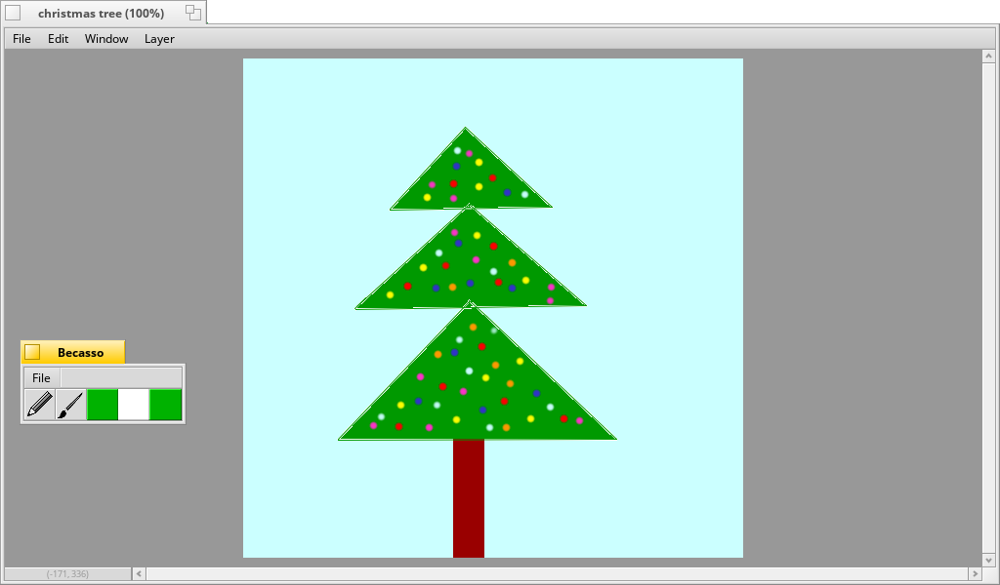

 
=======

Paint and imaging software for Haiku, originally written for BeOS by Sum Software.

Compilation
-----------

To compile, simply run jam:
	$> jam

Then you can run jam install to copy binaries and data files to subdirectory "target":
	$> jam install
